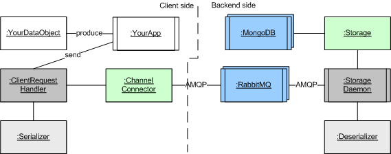
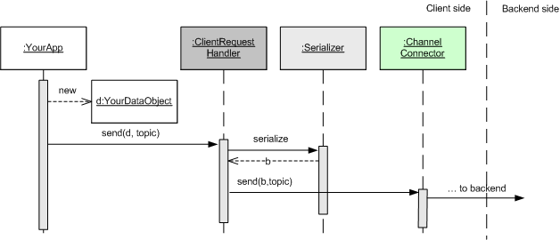
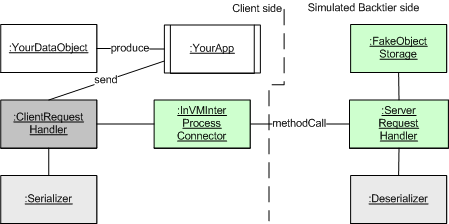

Karibu Tutorial
=======

Version 4 / April 2014.

This document summarizes the programming process involved in developing the
client side software, and the backend plug-in, to allow clients
to send data to the EcoSense backend for storage. It is based upon
the developed framework called *Karibu*. (Karibu is Swahili for "welcome").

*NOTE*: The Karibu system is stable but the current tutorial is still
in development.

**Henrik Baerbak Christensen, Aarhus University**

Overview of the process
----

Below I will describe a *staged testing process* which strives to
emphasize agile software development **fast development of reliable
software** . The staging involves several stages:

0. Make your core client side and backend side software work in a
*single node environment* (validates your code in a non-distributed
environment.) Karibu is designed to allow you to build the entire
client side user interface and domain logic in this environment thus
speeding up development significantly.

1. Make your configuration code work in a *distributed test
environment* (validates most of the RabbitMQ and Mongo parameters and
configurations as well as tests your client in a real distributed
environment but without fear of interferring with the full operational
system.)

2. Deploy your backend code on the *pre-production CS system*. This
allows realistic testing is a safe environment that never-the-less
is similar to the operational environment.

3. Final deployment in the operational system. 

Only level 0 and 1 are described currently. More information regarding
level 2 and 3 will be provided later, or contact the author.

Architecture Overview
======================

The Component and Connector view shows the run-time architecture of
Karibu in the distributed operational environment:

(The notation is explained in [Christensen et al.], but briefly boxes
represent passive run-time objects; boxes with vertical lines at the sides
represent active objects (run-time processes); and a second frame behind states
there are many of the particular object.) 

The objects are colour-coded: white are those developed by the client
application (that is: your fantastic app), dark gray are default
implementations provided by Karibu; light gray are objects you must
develop to configure Karibu for your particular usage; blue are 3rd
party components; and finally the green object is a variability point
which can be configured with various default implementations.

The typical use case is the client sending one data collection object
to the backend for storage. This use case is shown in the following
sequence diagram:

Your application produces a data object, and you call the `send`
method of the Karibu ClientRequestHandler object. It will use your
injected Serializer to convert your data object into a binary payload
suitable for transport, and next use a ChannelConnector to send it to
the backend. The default ChannelConnector for operational mode is a
RabbitMQ client that will send it to a RabbitMQ cluster at CS.

(Backend processing description pending... Short version: The storage
daemon receives binary payload as they are received by the RabbitMQ;
it deserializes it using your provided deserializer (binary to MongoDB
JSON object format) and will ask the Storage object to store it. The
default Storage object will insert the object as a new document into
database `ecosense` in the collection named by the producer code.)

Download and Tool chain
=======================

To compile and execute, you need at least the following tools in
minimum versions: *Java JDK 1.7*, *Apache Ant 1.8* and *Apache Ivy
2.3* for dependency management. You also need network access to
download the two Karibu modules (producer and consumer) as well as
modules that Karibu depends upon. Please review the ivy.xml file.

The source code at GitHub will become available as soon as our
TechTrans administration allows us.

Level 0: Developing in the single-node environment
==================================

**This is the recommended mode for developing the GUI and application
  logic as you avoid a distributed environment all together**

The process for the client side developer requires three steps for
successful uploading data to the backtier:

1. Develop and test the serialization and deserialization implementation
2. Configure the Karibu framework's client side objects
3. Configure the Karibu framework's backend objects for single-node development

Below the three process steps are examplified on a very simple "Hello
World" data model. Please refer to the JUnit example code in
`karibu-tutorial/test/cs/ecosense/helloworld/stage1/TestRoundtrip.java`
which contains all the code shown below.

The JUnit test cases are executed (along with other test cases) by
issuing 'ant test' in the `karibu-tutorial` folder.

Note: For "historical reasons" the level 0 testing is located in a subfolder
named "stage1" in the test folder.

Step 1: Serialization and deserialization step
-------------

Your client's data objects must be serialized into a byte
array for transmission to the backend, and deserialized into
a MongoDB BSON object. I advice to develop these using
normal test-driven development and JUnit:

  1. Create an object of your client side data type.
  2. Test-drive develop an implementation of the Karibu `Serializer`
  interface using asserts on the binary output format. The serializer
  is responsible for producing a byte array representing the format
  used 'on the wire'.
  3. Test-drive develop an implementation of the Karibu `Deserializer`
  interface by using the binary output of the previous step as input,
  and validate the structure of the output MongoDB JSON object.
  The deserializer is used in the backend to convert from the byte
  array to the MongoDB object that should be stored.

### Example

For this purpose I will develop using a very simple domain object
(rather irrelevant for a Ubicom audience, but will do for the
tutorial), namely one that captures a person and his/her favorite
computer game.

An example client side domain class,
`ExampleDomainClass`, is defined as

    /* An example of a domain class */
    class ExampleDomainClass {
      private String name;
      private String game;
    
      public ExampleDomainClass(String name, String favoriteComputerGame) {
        this.name = name;
        this.game = favoriteComputerGame;
      }
    
      public String getName() {
        return name;
      }
    
      public String getGame() {
        return game;
      }
    }

As our transport layer will ultimately require any object to send in
binary format, we must settle on a serialization and deserialization
scheme. JSON, XML, or Protocol Buffers are likely candidates for
production. Here, however I will do it 'the raw way' and settle on a
binary format that codes the two string parameters as a sequence of
bytes, with a `|` as separator between the two strings.

The code below illustrates the (resulting) test case that was used to
drive the implementation of `Serializer` and `Deserializer`
implementations. The setup() method has defined the object `ex` as

    ex = new ExampleDomainClass("Henrik", "StarCraft II");    

which is used in the test case below.

The resulting JUnit test case becomes:

    @Test
    public void shouldHaveIdemPotentSerialization() {
      Serializer<ExampleDomainClass> theSerializer = 
          new ExampleSerializer();
    
      // Serialize the domain object into a byte array
      // for on the wire transmission
      byte[] onTheWirePayload = theSerializer.serialize(ex);
    
      // Smoketest that the serialization is proper
      assertNotNull( onTheWirePayload );
    
      assertEquals( 'H', onTheWirePayload[0]);
      assertEquals( 'k', onTheWirePayload[5]);
      assertEquals( '|', onTheWirePayload[6]);
      assertEquals( 'S', onTheWirePayload[7]);
      assertEquals( 'C', onTheWirePayload[11]);
      assertEquals( 't', onTheWirePayload[15]);
    
      // Next, deserialize it into a MongoDB BSON object
      Deserializer theDeserializer = new ExampleDeserializer();
       
      BasicDBObject dbo = theDeserializer.buildDocumentFromByteArray(onTheWirePayload);
    
      // And smoketest that indeed the mongo object corresponds to
      // the original client side object
      assertNotNull(dbo);
    
      assertEquals("Henrik", dbo.get("name"));
      assertEquals("StarCraft II", dbo.get("game"));
    }
  
  
You may use any technique to serialize and deserialize, like using
open source JSON modules, Google protocol buffers, or hand code it all
by yourself. 
    
Assuming that you have a decent test suite that validates that your
serialization and deserialization works ok, you can move on to the
next step.

* NOTE: **MongoDB cannot store objects whose key fields contain '.'
  (dots).** Ensure that your serialization does not produce
  such. (Beware for automatic serialization of inner objects as they
  likely will use dot-notation.) 

Step 2. Client side Karibu objects
-------------

In this step, we configure the Karibu client side framework objects to
transmit the data object to the backend tier. 

In this section we avoid the RabbitMQ connector, and instead use
Karibu's test implementations that allow a full upload to be
*simulated* in a single process in-memory setup. This is designed to
allow speedy development of the client side without having to setup a
distributed environment. The Level 1 section later in the document
will demonstrate Karibu's RabbitMQ implementation meant for production
code.

Thus the run-time view mimics the production environment but with
important differences as shown in the component connector view below.
    

Basically, you instantiate a `StandardClientRequestHandler` from the
Karibu framework, and use its `send` method to upload data to the
backend. This default class provides retry-and-failover code which
means it will repeatedly attempt upload in case the connection has
been lost, and in the full production environment it will also
failover to a secondary RabbitMQ in case the primary is down.

The client request handler is an architectural pattern, described in
POSA volume 4. In Karibu, you configure the client request handler
with four parameters
  
  1. The domain class type (as a generic type)
  2. The producer code (explained below)
  3. The channel connector to use (the transport medium, explained below)
  4. The serializer to use (the one we defined in the previous step).

The snippet of JUnit code (test method `shouldStoreASentObject()`)
from the example looks like this:

    private final static String EXAMPLE_PRODUCER_CODE = "EXMXX001"; 

    ClientRequestHandler<ExampleDomainClass> crh =  
        new StandardClientRequestHandler<ExampleDomainClass>( 
            EXAMPLE_PRODUCER_CODE,  
            connector, new ExampleSerializer()); 

Below we dig into details of the producer code and the channel
connector.
 
### The producer code semantics
    
Message queue systems do not retain information about the producer of
a message. Thus for the backend to know how to deserialize the payload
and to know which collection to store the object in, you have to
identify yourself as producer of the data. This is done using the
*producer code*: the producer's unique ID.

In Karibu the producer code is exactly 8 characters (UTF-8) that
uniquely must identify the producer as well as what version of the
data is sent.

The format used in EcoSense is defined as 

    // Karibu uses a 8 character (UTF-8) code to 
    // identify the producer of data, called 
    // a 'producer-code' [The pattern 
    // "format indicator" in Hohpe and Woolf 2003] 
    // Format of codes: PPPTTVVV 
    // PPP = Three letter identifying the sub project, GFK for grundfos dorm, etc. 
    // TT = Two letter identifying the type of produced data, RE for reading, SC for sensor characteristica 
    // VVV = Three digit version identifier 
     
Example: `GFKRE003` defines the producer of data as the grundfos dorm,
the data type is 'reading', and finally the version of the data sent
as 3.

However, a deployment may define its own scheme - the only requirement
of Karibu is that the code is exactly 8 bytes long.

### The channel connector

The client request handler must know which channel connector to use. The
connector is the transport medium and a standard RabbitMQ
implementation is used in production; however one may envision other
transports such as HTTP etc.

A connector must implement the interface `ChannelConnector`
interface.

For testing, an implementation that uses simple in-memory method
calls is provided by Karibu. From the test code:

    // Create the client side objects - these objects must always 
    // be defined for clients 
    ChannelConnector connector; 
    // Here we use an in-memory connector, a normal client shall 
    // instead use the RabbitMessageProducer connector 
    connector = new InVMInterProcessConnector(srh); 
 
(The `srh` object is the request handler on the server side, and
explained below in the backend section.)

### Sending the data object

Given a correctly configured client request handler, the actual
sending is simple - just call the `send` method and supply the object
itself, as well as a *topic*. The topic defines 'what we are talking
about' and must follow some rules for the Karibu daemon to interpret
it correctly, see below.

Thus the code is:

    // Client side 'normal operations' is just sending data to
    // the server   
    try {
      crh.send(ex, "exampleproject.reading.store");
    } catch (IOException e) {
      e.printStackTrace();
    }

Note that an IOException may occur which of course tell you that the
send has failed. Currently, the send actually implements *fail-over*
semantics and a retry is attempted to send to another rabbit in the
cluster. 

The second parameter of the `send` defines the topic. The topic
concept is explained in detail in "RabbitMQ in Action" and RabbitMQ
tutorial on the web. In Karibu the topic must have a specific format
as outlined in the JavaDoc for `send`.

    * Topics are strings on the form "A.B.C", that is,
    * three parts separated by dot.
    * A = name of experiment/client/project; example "grundfos".
    * B = type of the data; example "reading".
    * C = type of backend processing; example "store".

**Note: The Karibu daemons are configured to only store objects sent
with "store" as the C part of the topic**

Step 3. Backend Karibu objects
-------------

In a distributed enviroment, the backend karibu objects are of course
configured by the backend services. However, the test
implemenations allows us to set them up for local single machine
testing. This is explained in this section.

The backend requires three things to be set up:

  * Implementation of the `Storage` - the database to store MongoDB
  objects in.
  * The `DeserializerFactory` which is a sort of Abstract Factory 
  which returns a proper Deserializer object based upon the provided
  producer code 
  * The `ServerRequestHandler` which is the backend match for the
  ClientRequestHandler (again a POSA Vol. 4 pattern).

A standard implementation `StandardServerRequestHandler` is provided
by Karibu which is just configured by the storage and the deserializer
factory.
    
For the storage we use a Fake Object [Meszaros] that just
remembers the last stored object; and as our test case only knows a
single producer code there is little need for a fancy factory of
deserializers:

    // Create a fake object storage
    FakeObjectStorage storage = new FakeObjectStorage();
    // Create the factory which the server side uses to
    // lookup the deserializer
    DeserializerFactory factory = new DeserializerFactory() {
      @Override
      public Deserializer createDeserializer(String projectCode) {
        // Ignore the code as we only operate in test environment
        return new ExampleDeserializer();
      }
    };
    // Create a server side request handler
    ServerRequestHandler srh = new StandardServerRequestHandler(storage, factory);

Here you see the definition of the `srh` object that was used in the
`InVMInterProcessConnector` in the client side code.

### Complete JUnit client side test 

      @Test
      public void shouldStoreASentObject() {
        // First, for the sake of testing, we have to create the
        // server side stub and fake objects. THIS IS NOT PART
        // OF PRODUCTION CLIENT SIDE DEVELOPMENT. See the
        // Hello World documentation!
        
        // Create a fake object storage
        FakeObjectStorage storage = new FakeObjectStorage();
        // Create the factory which the server side uses to
        // lookup the deserializer
        DeserializerFactory factory = new DeserializerFactory() {
          @Override
          public Deserializer createDeserializer(String projectCode) {
            // Ignore the code as we only operate in test environment
            return new ExampleDeserializer();
          }
        };
        // Create a server side request handler
        ServerRequestHandler srh = new StandardServerRequestHandler(storage, factory);
        // === End of creating server side objects
        
        // === CLIENT SIDE
        // Create the client side objects - these objects must always
        // be defined for clients
        InterProcessMessageProducer connector;
        // Here we use an in-memory connector, a normal client shall
        // instead use the RabbitMessageProducer connector
        connector = new InVMInterProcessConnector(srh);
        // Configure the actual 'sender' object. It requires a
        // unique 6-character long producer code to identify the
        // sender of data (see HelloWorld tutorial for a description
        // of the format); which connector to use to send
        // the data; and of course which serializer to use
        // to create the byte array payload to send over the wire.
        ClientRequestHandler<ExampleDomainClass> crh = 
            new StandardClientRequestHandler<ExampleDomainClass>("EXMT01", 
                connector, new ExampleSerializer());
        
        // Client side 'normal operations' is just sending data to
        // the server   
        try {
          crh.send(ex, "exampleproject.reading.store");
        } catch (IOException e) {
          e.printStackTrace();
        }
    
        // Validate that the object has been stored in the data storage
        BasicDBObject dboStored = storage.lastDocumentStored();
        assertEquals("Henrik", dboStored.get("name"));
      }
    

Level 1: A simple distributed test environment
==================

In this stage we start using the real RabbitMQ implementations for the
`ChannelConnector`, and use a backend implementation, in a distributed
test environment.

For "historical reasons", you will find the associated (manual) test
code in `karibu-tutorial/test/cs/ecosense/helloworld/stage2`. The two
main programs are `Producer` and `Consumer` and these are run by the
ant targets `prod` and `cons` respectively.
 
You need to have a RabbitMQ server running for the tests to succeed
(you may use your development machine to act as both producer, consumer and
rabbit mq server).

If you want to avoid the hazzle of installing RabbitMQ and Erlang, you
may download a Ubuntu Server 12.04 LTS with RabbitMQ installed as a
VMWare image at
(http://users-cs.au.dk/baerbak/c/vm/Duma-RSA-RabbitMQ.zip). Once
started in e.g. VMWare Player (which is free of charge) you will have
a full RabbitMQ running with the web dashboard enabled. You can access
the webboard on (IP-of-RabbitMQ):15672 with username 'guest' and pwd
'guest'. The virtual machine is one I use in my teaching and has
username 'rsa' and password 'csau'.

You have to provide the IP of your RabbitMQ machine to the producer
and consumer programs. Assuming your RabbitMQ machine (or virtual
machine) has IP=xx.xx.xx.xx, you have to tell the producer and
consumer programs through the Ant `mq.ip` property, like

    ant -Dmq.ip=xx.xx.xx.xx cons
    ant -Dmq.ip=xx.xx.xx.xx prod
    
Please note that running the producer and consumer will have lasting
side effects on the RabbitMQ server (similar to real production!).
If you run the `ant prod` on a fresh RabbitMQ server without having ever
run the `ant cons` then the transmitted messages are lost. This is because
it is the consumer side that defines the queues and tells them to
be 'durable'. Once a consumer has been run once, the RabbitMQ server
will remember that the queue is durable until the server is either
reinstalled or you manually remove the queue using the dashboard.

For more information on RabbitMQ, consult resources like [RabbitMQ].

Step 1. Client configuration using RabbitMQ
-----------

The setup is of course similar to Level 0 explained above; the only
change is the implementations to use. Basically it is just the
`connector` which is replaced by its `RabbitMessageProducer`
implementation. The code below is from the `Producer` application.

    ChannelConnector connector = null; 
    // Define the characteristics of the exchange on the Rabbit MQ. 
    RabbitExchangeConfiguration rec = 
        new ExampleExchangeConfiguration(rabbitMQServerName); 
    
    // And try to instantiate the connector 
    try { 
      connector = new RabbitChannelConnector( rec ); 
    } catch (IOException e) { 
      e.printStackTrace(); 
    } 
    // Next configure the client request handler 
    ClientRequestHandler<ExampleDomainClass> crh; 
    crh = new StandardClientRequestHandler<ExampleDomainClass>(ExampleCodes.EXAMPLE_PRODUCER_CODE,  
        connector, new ExampleSerializer()); 

The only difference to the Level 0 testing example from the previous
sections is that the constructor of RabbitMessageProducer may throw an
IOException; and that you have to configure the Rabbit Exchange using
`RabbitExchangeConfiguration`. The `ExampleExchangeConfiguration` uses
default parameters for the rabbit regarding username, password, port,
and exchange configurations.

Step 2. Backend configuration using RabbitMQ
------------

Again, the backend configuration is very similar to Level 0. From the
`Consumer`application:

    // As storage, we use a null storage that simply outputs to the shell 
    ProcessingStrategy database; 
    database = new ExampleShellOutputNullStorage(); 
       
    // No fancy factory for deserializers, we know the single one 
    // that must be used. 
    DeserializerFactory factory = new DeserializerFactory() { 
      @Override 
      public Deserializer createDeserializer(String producerCode) { 
        Deserializer returnvalue = null; 
        if ( producerCode.equals(ExampleCodes.EXAMPLE_PRODUCER_CODE)) { 
          returnvalue = new ExampleDeserializer(); 
        } else { 
          log.error("Requested deserializer for unknown producer code: "+producerCode); 
        } 
        return returnvalue; 
      } 
    }; 

In this setup, we have still not connected a real MongoDB database
server, to keep the learning curve shallow. So, we configure a
`ExampleShellOutputNullStorage` storage as `ProcessingStrategy`. This
is not really a database, it just prints any stored object to the
console so we can visually inspect that there is indeed coming data
through.
   

One crucial, additional step is necessary, as we have to start a
receiver thread which can feed received messages into the
ServerRequestHandler. This is expressed by the class
`MessageReceiverEndpoint` and interface `PollingConsumer` (again
patterns from Hohpe and Woolf). The MessageReceiverEndpoint provides
server side failover and reconnect code in case of loosing connection;
and the PollingConsumer provides the blocking `nextDelivery()` method
that retrieves messages from the RabbitMQ. Thus it must of course be
configured for the proper exchanges and queues of the RabbitMQ,
handled by a RabbitExchangeConfiguration (same as in the client side!)
and in addition a queue configuration `RabbitQueueConfiguration`.

    // Configure the rabbit exchange and queue 
    RabbitExchangeConfiguration rec =  
        new ExampleExchangeConfiguration(rabbitMQServerName); 
    RabbitQueueConfiguration rqc =  
        new ExampleStorageQueueConfiguration(); 
    
    // No need for any statistics collection so we just
    // use a 'null object' handler
    StatisticHandler statisticsHandler = new NullStatisticsHandler();
 
    // Configure and create the MessageReceiverEndpoint, 
    // using a RabbitMQ as polling consumer 
    PollingConsumer pollingConsumer = 
        new RabbitMQPollingConsumer( rec, rqc ); 
    // .... and configure it and spawn the thread 
    MessageReceiverEndpoint receiverEndpoint;
    receiverEndpoint = new MessageReceiverEndpointFactory.Builder().
        pollingConsumer(pollingConsumer).
        processingStrategy(database).
        deserializerFactory(factory).
        logger(log).
        statisticsHandler(statisticsHandler).
        build();
        
    // Finally, spawn the thread ... 
    Thread receiverThread = new Thread( receiverEndpoint, "ReceiverThread" ); 
    System.out.println("Start receiving payloads. Hit Ctrl-C to terminate..."); 
     
    receiverThread.start(); 
    receiverThread.join(); // delay main thread until receiver endpoint terminates. 

The `MessageReceiverEndpoint` is highly configurable in order to
inject all kinds of *saboteur* instances [Mezaros] that allow
automatic testing of failover code in Karibu. Therefore a Builder
pattern [Bloch] (from "Effective Java", not the classic Gamma et
al. pattern) is used to configure it.

Step 3. Adding a real MongoDB database
---------

Pending...

Level 2: Pre-Production environment
============

Pending...

(Describe setup of clustered RabbitMQ and replica set MongoDB).

Level 3: Operations in the production environment
=============

Pending...

(Discuss security settings and encrypted connections.)

    
Literature
==========
    
[Christensen et al.] ["The 3+1 Approach to Software Architecture Description Using UML"](http://cs.au.dk/~baerbak/c/atisa/notes/ad-3p1model.pdf)

[POSA] "Patterns of Software Architecture Volume 4: A Pattern Language for Distributed Computing", Addison-Wesley 2007

[RabbitMQ] Videla, Williams: "RabbitMQ in Action: Distributed Messaging for Everyone", Wiley 2012

[Meszaros] Gerard Meszaros: "xUnit Test Patterns:
Refactoring Test Code", Addison Wesley, 2007

[Bloch] Joshua Bloch: "Effective Java, 2nd Edition", Pearson Education, 2008
    

This tutorial is written by: *Henrik Baerbak Christensen, CS at Aarhus
University*
    
Any comments welcome at `hbc at cs dot au dot dk`.
    
    
    
    