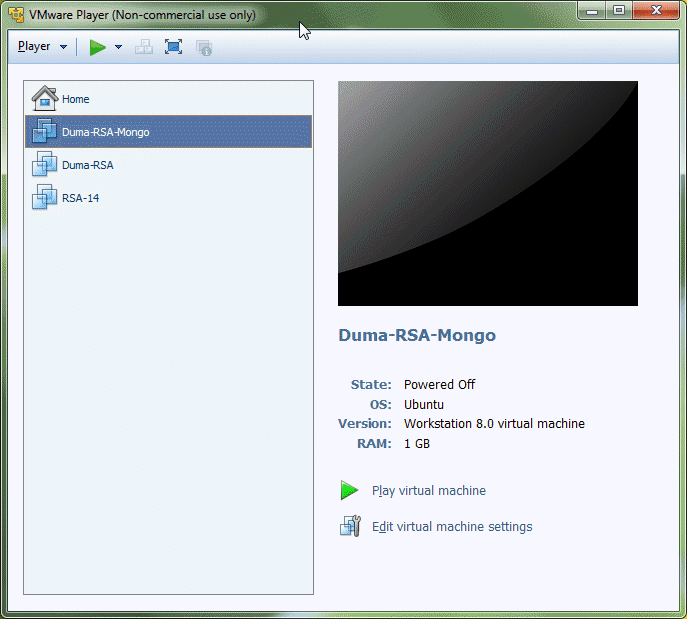
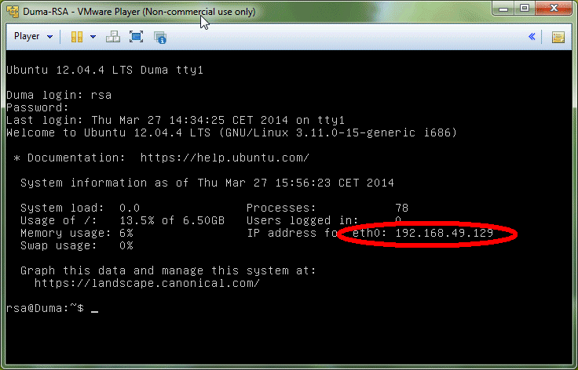
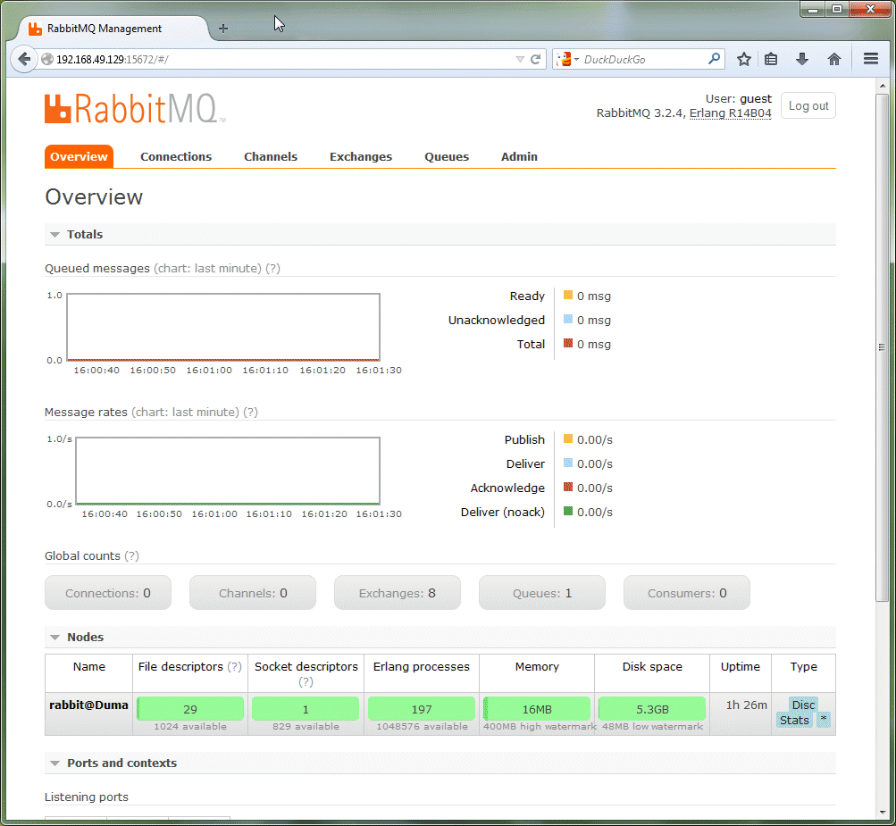
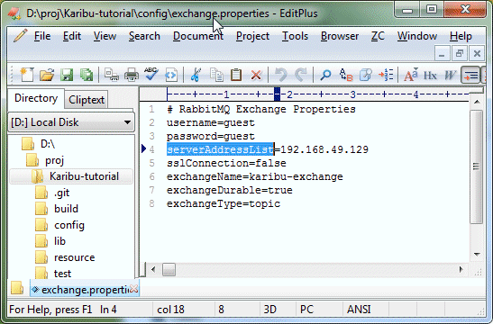
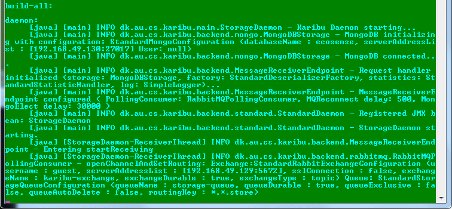

Karibu Quick Start
============

Version 1 / July 2014

In this tutorial you will setup a distributed system having a client,
a messaging system, a daemon, and a database. Then you will start
sending data from the client through the Karibu system and see it
stored safely in the database.

Mise en place
----

This tutorial requires three nodes to be running: 

  1. your development machine will act both as a client as well as host
    the Karibu daemon

  2. a node that runs the RabbitMQ messaging system

  3. a node that runs the MongoDB database

To avoid the hazzle of setting up the latter two nodes, I recommend
downloading two Ubuntu Server 12.04 LTS virtual machines that are
already setup correctly.

The virtual machines are in VMWare format. They have been tested to
work with VMWare's virtual machine monitor VMWare Player which is free
for personal use. You can find and download from VMWare's website.

Once installed, download the two VMs:

  * [Duma MQ](http://users-cs.au.dk/baerbak/c/vm/Duma-RSA-RabbitMQ.zip)  

  * [Duma DB](http://users-cs.au.dk/baerbak/c/vm/Duma-RSA-MongoDB.zip)

Unzip them in some suitable place. Start you VMWare player, select
*Open a Virtual Machine* and select the VM. 

The virtual machines are some that I use in my teaching and both have
username 'rsa' and password 'csau'.

### Get the MQ node running

Next request to execute it. If asked, select that you have copied
it. Other questions are usually regarding peripherical devices (skip
them) or VMWare tools (skip that as well). 

Log onto the machine, and note its IP (which we will call *mqip* in
the rest of the tutorial.)

You now have a RabbitMQ running, and can log into its dashboard using
your web browser - enter the URL *mqip:15672*. Log in using
name _guest_ and password _guest_ to get to the dashboard.

### Get the MongoDB node running

Repeat the very same procedure to start the Duma-DB machine and note
its IP (*dbip*). 

Start the daemon
---

The daemon fetches messages from the MQ, deserializes the binary
payload into a MongoDB document, and stores it in the MongoDB.

Therefore the daemon must of course be configured to talk with both
RabbitMQ and MongoDB. It does so using property files.

In the root of this tutorial you will find the `config` folder. Open
your favorite editor on the `exchange.properties` file and enter your
*mqip* as value to the key `serverAddressList`. The rest of the
properties should do just well.

Do the same with the `mongo.properties` file - change the
`serverAddressList`s value to the *dbip* you noted from the virtual
machine.

OK, everything should be set. Let us start the daemon.

   ant daemon

and you should see something along the lines of (on Win7 some
connections take a while to start).

(if you wonder why the logging information is going to the shell, it
is because the tutorial's ivy.xml file uses the simple SLF4J
logger. If you change the binding to the Log4J logger, logging should
go to `karibu.log` instead.)

If this step fail, carefully review that you have set the IP addresses
correctly in the property files.

Start data collection
---

