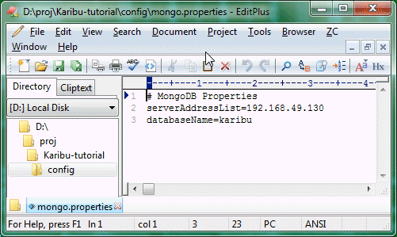

Karibu Quick Start
============

Version 2 / August 2014

In this tutorial you will setup a distributed system having a client,
a messaging system, a daemon, and a database. Then you will start
sending data from the client through the Karibu system and see it
stored safely in the database.

Mise en place
----

This tutorial requires three nodes to be running: 

  1. your development machine will act both as a client as well as host
    the Karibu daemon

  2. a node that runs the RabbitMQ messaging system

  3. a node that runs the MongoDB database

To avoid the hassle of setting up the latter two nodes, I recommend
downloading two Ubuntu Server 12.04 LTS virtual machines that are
already setup correctly.

The virtual machines are in VMWare format. They have been tested to
work with [VMWare Player](http://www.vmware.com/go/downloadplayer/)
for Windows and Linux, which is free for personal use, or
[VMWare Fusion](http://www.vmware.com/products/fusion/) for OS X, which
has a free trial.

Once installed, download the two VMs (about 400MB each):

  * [Duma MQ](http://users-cs.au.dk/baerbak/c/vm/Duma-RSA-RabbitMQ.zip)  

  * [Duma DB](http://users-cs.au.dk/baerbak/c/vm/Duma-RSA-MongoDB.zip)

Unzip them in some suitable place. Start your VMWare player, select
*Open a Virtual Machine* and select each of the VMs.

The virtual machines are some that I use in my teaching and both have
username 'rsa' and password 'csau'.

### Get the MQ node running

Next request to execute it. If asked, select that you have copied
it. Other questions are usually regarding peripherical devices (skip
them), or VMWare tools (skip that as well). 

Log onto the machine, and note its IP (which we will call *mqip* in
the rest of the tutorial.)

You now have a RabbitMQ running, and can log into its dashboard using
your web browser - enter the URL *mqip:15672*. Log in using
name _guest_ and password _guest_ to get to the dashboard.

### Get the MongoDB node running

Repeat the very same procedure to start the Duma-DB machine and note
its IP (*dbip*). 

Start the daemon
---

The daemon fetches messages from the MQ, deserializes the binary
payload into a MongoDB document, and stores it in the MongoDB.

Therefore the daemon must of course be configured to talk with both
RabbitMQ and MongoDB. It does so using property files.

In the root of this tutorial you will find the `config` folder. This
folder has three default property files. Copy each one to a new file
without the `default` prefix:

  * `exchange.properties.default` -> `exchange.properties`
  * `mongo.properties.default` -> `mongo.properties`
  * `queue.properties.default` -> `queue.properties`

Open `exchange.properties.default` in your favorite editor and
enter your *mqip* as value to the key `serverAddressList`. The rest
of the properties should not need to be changed.

Do the same with the `mongo.properties` file - change the
`serverAddressList`s value to the *dbip* you noted from the virtual
machine.

The `queue.properties` file does not need to be edited for this tutorial.

OK, everything should be set. Let us start the daemon.

    ant daemon

and you should see something along the lines of (on Win7 some
connections take a while to start).

(if you wonder why the logging information is going to the shell, it
is because the tutorial's `ivy.xml` file uses the simple SLF4J
logger. If you change the binding to the Log4J logger, logging should
go to `karibu.log` instead, which is what we do in production.)

If this step fails, carefully review that you have set the IP addresses
correctly in the property files.

To stop the daemon, you just hit Ctrl-C.

Start data collection
---

To simulate data collection from a device, you should start the load
generator from another shell.

     ant load

This will start uploading data every second to the MQ which will then
be fetched by the daemons and stored in the DB.

To validate, please check the MQ dashboard.

Here you see that the publish and deliver rates are around 1 message
per second as expected. You can also click on the tabs
for *Connections*, *Exchanges*, and *Queues*, to see the different
connections and objects that the daemon has defined.

To validate that data is indeed stored in the DB, find your Duma-DB
virtual machine, and start the Mongo shell:

    mongo

and then execute the following commands:

    use karibu
    show collections
    db.EXMRE001.count()

Here you see that 77 documents have been stored in the EXMRE001
collection in the karibu database. That data ends in the karibu
database as was defined in the `mongo.properties` configuration; and
the collection is defined by the *producer code* as explained in the
[Hello World](helloworld.md) tutorial.

Code Walkthrough
===

This tutorial contains a single Java class `GenerateLoad` to simulate
a client that uploads data (in `test/cs/karibu/quickstart`), and just
uses the default Karibu daemon which is part of the Karibu-core
modules.

The explanations below assumes you have read the [Hello
World](helloworld.md) tutorial.

Producer code
---

The configration of the client side objects uses the default
implementations for Karibu production use, namely those that read
property files. Karibu comes with a PropertyReader which is designed
to fail fast.

    // Read in the property files
    PropertyReader rr = new PropertyReader(resourceFolderRoot);
    Properties exchangeProperties = rr.readPropertiesFailFast("exchange");

    // Configure the connector to the MQ
    ChannelConnector connector = null; 
    RabbitExchangeConfiguration rabbitExchangeConfig =
        new StandardRabbitExchangeConfiguration(exchangeProperties);
      
    connector = new RabbitChannelConnector( rabbitExchangeConfig ); 
    
    // Configure the client request handler
    ClientRequestHandler<ExampleMeasurement> readingHandler;
    StandardJSONSerializer<ExampleMeasurement> serializer;
    serializer = new StandardJSONSerializer<ExampleMeasurement>();

    readingHandler = new StandardClientRequestHandler<ExampleMeasurement>(DomainConstants.PRODUCER_CODE_EXAMPLE_MEASUREMENT,  
        connector, serializer ); 

Daemon execution
---

The ant script executes the daemon

    <target name="daemon" depends="build-all"ge
  	  description="---> Quick start - Run the daemon">
    <java classpathref="run.path.id" 
	  classname="dk.au.cs.karibu.main.StorageDaemon">
      <arg value="mongo"/>
      <arg value="${pf}"/>
      <sysproperty key="java.security.policy"
           path="setting/security.policy"/>
      <sysproperty key="com.sun.management.jmxremote.port"
           value="4672"/>
      <sysproperty key="com.sun.management.jmxremote.authenticate"
           value="false"/>
      <sysproperty key="com.sun.management.jmxremote.ssl"
           value="false"/>
      <sysproperty key="java.rmi.server.hostname"
           value="${rmiserver}"/>
    </java>
    </target>

Most of the configuration is through the second argument, the folder
which contains the property files. However, the standard daemon is
also JMX enabled, so be sure to set the `rmiserver` property of the
local machine (localhost does not work!) after which you can connect
to the instance using jconsole.

Experiments
---

  * Try shutting down the daemon process, but keep the load process going.
  What do you see happen in the RabbitMQ admin interface? What happens when
  you restart the daemon?

  * Try stopping the MongoDB for a short while
  (`sudo service mongodb stop` on the DB VM) before reenabling it
  (`sudo service mongodb start`). What do you see in the daemon log output,
  and the RabbitMQ admin interface?
